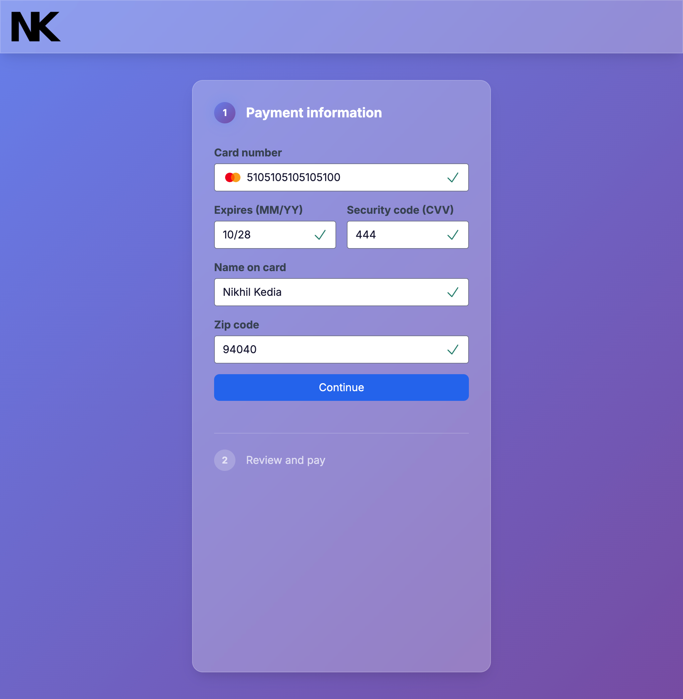

# Simple Payment Flow



[](https://nextjs.org/)
[](https://react.dev/)
[](https://www.typescriptlang.org/)
[](https://tailwindcss.com/)
[](LICENSE)

---

## Overview

**Simple Payment Flow** is a modern, accessible, and secure payment portal for bills and invoices, built with **Next.js 15**, **TypeScript**, and **Tailwind CSS**. The app guides users through a streamlined payment process with real-time validation, accessibility features, and a responsive design.

---

## Features

- 💳 **Credit Card Payment** with real-time validation
- 🔒 **CSRF Protection** (client-side, with recommendations for production)
- 🧑‍🦽 **Accessible**: Keyboard navigation, ARIA labels, and focus management
- 📱 **Responsive**: Works on all device sizes
- ✨ **Modern UI**: Clean, branded, and user-friendly
- 🧪 **Test Card Numbers**: [See test cards](https://www.paypalobjects.com/en_GB/vhelp/paypalmanager_help/credit_card_numbers.htm)

---

## Table of Contents

- [Simple Payment Flow](#simple-payment-flow)
  - [Overview](#overview)
  - [Features](#features)
  - [Table of Contents](#table-of-contents)
  - [Screenshots](#screenshots)
  - [Tech Stack](#tech-stack)
  - [Pages](#pages)
    - [Home/Welcome Page (`/app/page.tsx`)](#homewelcome-page-apppagetsx)
    - [Pay \& Review Page (`/app/PayAndReview/page.tsx`)](#pay--review-page-apppayandreviewpagetsx)
    - [Thank You Page (`/app/ThankYou/page.tsx`)](#thank-you-page-appthankyoupagetsx)
  - [Components](#components)
  - [Validation \& Accessibility](#validation--accessibility)
  - [Getting Started](#getting-started)
    - [Prerequisites](#prerequisites)
    - [Installation](#installation)
    - [Running the Development Server](#running-the-development-server)
    - [Building for Production](#building-for-production)
  - [Deployment](#deployment)
  - [Contributing](#contributing)
  - [License](#license)
  - [Acknowledgements](#acknowledgements)

---

## Screenshots

| Large (1024px)                    | Medium (768px)                    | Small (375px)                     |
| --------------------------------- | --------------------------------- | --------------------------------- |
|  |  |  |

---

## Tech Stack

- **Framework:** [Next.js 15.3.4](https://nextjs.org/)
- **Language:** [TypeScript 5.x](https://www.typescriptlang.org/)
- **Styling:** [Tailwind CSS 3.x](https://tailwindcss.com/)
- **Validation:** [validator.js](https://github.com/validatorjs/validator.js)
- **State Management:** React Context API

---

## Pages

### Home/Welcome Page (`/app/page.tsx`)

- Welcome message, user's name, and total amount due
- "Pay total" button to start payment

### Pay & Review Page (`/app/PayAndReview/page.tsx`)

- Step 1: Payment form with real-time validation
- Step 2: Review and confirm payment details
- Animated transitions between steps

### Thank You Page (`/app/ThankYou/page.tsx`)

- Confirmation message after successful payment

---

## Components

- **PaymentForm**: Handles all payment input and validation
- **InputField**: Reusable, accessible input with validation feedback
- **Icons**: Renders card brand, error, and success icons
- **ErrorText**: Contextual error messages for each field
- **Layout**: Consistent header and page structure

---

## Validation & Accessibility

- **Card Number**: Validated with `validator.isCreditCard`
- **Expiry**: MM/YY, must be a future date
- **CVV**: 3 or 4 digits, numeric
- **Name**: Must be at least two words, only letters and spaces
- **ZIP Code**: US postal code format
- **Focus Movement**: Focus moves to the next field only on Tab/Enter (not automatically)
- **Screen Reader Support**: ARIA labels and error messages
- **CSRF Protection**: Client-side token, see `CSRF_IMPLEMENTATION.md` for details

---

## Getting Started

### Prerequisites

- Node.js 18+
- npm, yarn, pnpm, or bun

### Installation

```bash
git clone https://github.com/yourusername/payment-flow.git
cd payment-flow
npm install
```

### Running the Development Server

```bash
npm run dev
```

Open [http://localhost:3000/payment-flow](http://localhost:3000/payment-flow) in your browser.

### Building for Production

```bash
npm run build
npm run start
```

---

## Deployment

- The app is statically exportable and can be deployed to Vercel, Netlify, GitHub Pages, or any static host.
- For GitHub Pages, ensure your `next.config.mjs` has the correct `basePath` and `output: 'export'`.

---

## Contributing

Contributions are welcome! Please open an issue or submit a pull request.

---

## License

This project is licensed under the MIT License.

---

## Acknowledgements

- [Next.js](https://nextjs.org/)
- [Tailwind CSS](https://tailwindcss.com/)
- [validator.js](https://github.com/validatorjs/validator.js)

---
